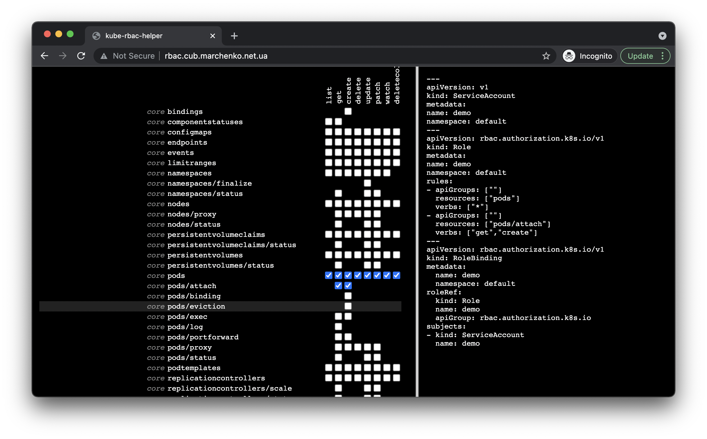

# kube-rbac-helper



Simple project to show list of available resources and configure role with role binding for a service account

To run it locally

```bash
docker run -it --rm -p 8080:8080 -v /Users/mac/Documents/dotfiles/kube/cub.yml:/cub.yml -e KUBECONFIG=/cub.yml mac2000/kube-rbac-helper
```
